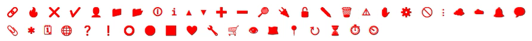

## Unicode Icons

This is my experiment to make an icons set like `mdi-icons` or `font-awesome` using standart unicode symbols.



Pros:  
+ 2,6 KB (747 bytes gzipped) only  
+ No need to draw the icons, they're taken from standart fonts  

Cons:  
- Different appearance in different browsers and operating systems (it depends on the font used)  
- A small number of icons  
- It's pretty hard to add a new icon (it must appear in The Unicode Standart) :)  


### Build

```bash
npm run build
```

Then you can find the resulting CSS files in the `/dist` folder

### Development

```bash
npm run dev
```

### Usage

```html
<span class="u-icon close"></span>
<span class="u-icon check"></span>
<span class="u-icon account"></span>
```

The whole list of icons can be found [here](https://github.com/flametaichou/unicode-icons/blob/main/src/_vars.scss).

There are some extra examples in the `index.html` file.